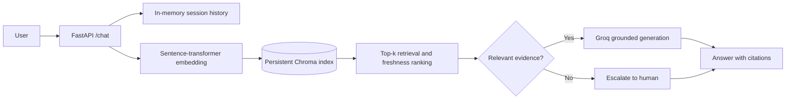

# LearnForge Support Assistant

A small retrieval-augmented generation (RAG) prototype for LearnForge customer support. It retrieves evidence from the supplied FAQs, policies, and past tickets, answers with citations through Groq, and escalates when the evidence or generation path is not reliable enough.

## What Is Included

- FastAPI `POST /chat` endpoint
- Persistent Chroma vector index
- Local `all-MiniLM-L6-v2` embeddings
- Groq generation with a grounded prompt
- Per-session multi-turn history
- Confidence threshold and explicit escalation responses
- Source citations using document IDs such as `[POLICY-02]`
- Parser and behavior tests that run without a Groq key

## Quickstart

Python 3.11+ is required.

```powershell
cd learnforge-support-bot
python -m venv .venv
.\.venv\Scripts\Activate.ps1
python -m pip install -e ".[test]"
Copy-Item .env.example .env
```

Add a Groq key to `.env`:

```text
GROQ_API_KEY=your_key_here
```

Build the local index:

```powershell
learnforge-index --data-dir data --chroma-path .chroma
```

Start the API:

```powershell
uvicorn learnforge_support.api:app --app-dir src --reload
```

Open `http://127.0.0.1:8000/docs` for the interactive API documentation.

Example request:

```powershell
Invoke-RestMethod http://127.0.0.1:8000/chat -Method Post -ContentType "application/json" -Body '{"session_id":"demo-1","message":"Can I get a refund for a course I bought yesterday?"}'
```

The first index build downloads the embedding model. The generated `.chroma/` directory is local runtime state and is ignored by Git.

## Multi-turn Proof

Conversation state is keyed by `session_id`. Send the first request:

```powershell
Invoke-RestMethod http://127.0.0.1:8000/chat -Method Post -ContentType "application/json" -Body '{"session_id":"refund-demo","message":"I bought a course yesterday. Can I get a refund?"}'
```

Then send a follow-up with the same `session_id`:

```powershell
Invoke-RestMethod http://127.0.0.1:8000/chat -Method Post -ContentType "application/json" -Body '{"session_id":"refund-demo","message":"What information should I include?"}'
```

The second request is not a new conversation. `ChatService` passes the first user message and generated answer to the generator before answering the follow-up. The automated proof is `test_session_history_is_forwarded_on_follow_up` in `tests/test_chat.py`; it verifies the first turn has zero history and the second turn receives the exact two-message history.

Example generator observations:

```text
first turn:  history=[]
second turn: history=[user: "I bought a course yesterday. Can I get a refund?", assistant: "..."]
```

Use a new `session_id` to start a separate conversation. History is intentionally in memory for this prototype and is lost when the API process restarts.

## Architecture



## Data Schema

Each logical FAQ, policy, or ticket entry becomes one record. The prototype keeps one entry per chunk because the supplied entries are already short enough for the model context window.

```json
{
  "id": "policy-02_<content_hash>",
  "document": "Cancellation and Refund Policy\\n\\n...",
  "metadata": {
    "source": "policies.md",
    "document_type": "policy",
    "document_id": "POLICY-02",
    "title": "Cancellation and Refund Policy",
    "chunk_index": 0,
    "last_updated": "January 2026",
    "effective_date": "January 2026",
    "contains_stale_reference": true
  }
}
```

The deterministic content hash makes re-indexing reproducible. `contains_stale_reference` does not mean that the whole document is obsolete; it marks a record that explicitly discusses older, archived, or replaced guidance. Current policy evidence is ranked ahead of those references while the evidence remains available for conflict analysis.

## Failure Handling

- **Low retrieval confidence:** if no records are returned or the best relevance score is below `MIN_RELEVANCE_SCORE`, the API returns `escalated: true` instead of guessing.
- **Missing Groq key:** the API still runs, but returns a clear escalation response rather than generating an ungrounded answer.
- **Provider failure:** generation exceptions become escalation responses; they are not exposed as fabricated support answers.
- **Stale or conflicting guidance:** policy records with current metadata rank ahead of records containing archived-language references. The answer prompt is instructed to cite sources and avoid unsupported claims. Ambiguous policy cases should be escalated.
- **Sensitive information:** the prompt and corpus guidance tell the assistant not to request full card numbers, CVVs, passwords, PINs, or authentication codes.
- **Session state:** history is bounded in memory. Production should use an authenticated, persistent session store with expiry and encryption controls.

## Evaluation Plan

Start with a labelled test set covering:

1. Direct FAQ questions, such as password reset and course access.
2. Policy questions where current guidance conflicts with archived language.
3. Multi-turn clarification, such as distinguishing cancellation from a refund.
4. Support-ticket patterns, such as pending authorizations and missing progress.
5. Out-of-domain or underspecified requests that should escalate.

Measure:

- **Retrieval recall@k:** whether the expected source ID appears in the top-k results.
- **Answer groundedness:** human or judge-model checks that each material claim is supported by a cited chunk.
- **Citation accuracy:** whether cited IDs actually support the answer.
- **Escalation precision and recall:** whether uncertain cases escalate without blocking answerable questions.
- **Resolution quality:** rubric score for correctness, actionable next steps, and appropriate handling of sensitive data.
- **Latency and cost:** retrieval time, generation time, token usage, and provider error rate.

For an initial benchmark, create 30-50 labelled questions, run every change against the same set, and manually review every failure. The current automated tests focus on parser correctness, metadata, ranking, escalation, sessions, and API shape; they intentionally do not claim to measure LLM quality.

## Trade-offs

- **RAG over fine-tuning:** policies and FAQs change frequently, so re-indexing is cheaper and faster than retraining. Fine-tuning could improve tone or classification later but would not be the source of truth.
- **Chroma over a hosted vector database:** Chroma keeps the take-home runnable with no paid infrastructure. A production system would need managed storage, backups, filtering, observability, and concurrent access controls.
- **Local embeddings over an embedding API:** this removes another secret and API dependency, at the cost of a model download and local CPU/memory use.
- **One logical entry per chunk:** it keeps citations simple and preserves policy context. Larger documents would need section-aware chunks with overlap and potentially a reranker.
- **In-memory history:** it demonstrates multi-turn behavior with minimal infrastructure. Production requires authenticated persistent sessions, retention limits, and privacy controls.
- **Threshold gate plus grounded prompting:** neither mechanism guarantees truth by itself. A production rollout should add a reranker, structured model output, contradiction checks, monitoring, and human-reviewed evaluation data.

## Project Layout

```text
src/learnforge_support/
  api.py          FastAPI routes and request/response models
  chat.py         Session handling, confidence gate, and Groq generation
  config.py       Environment-backed settings
  ingestion.py    Markdown parsing and index command
  models.py       Knowledge record schema
  retrieval.py    Chroma persistence and ranking

data/             Supplied LearnForge corpus
tests/             Focused unit and API tests
```

Run tests with:

```powershell
python -m pytest -q
```
